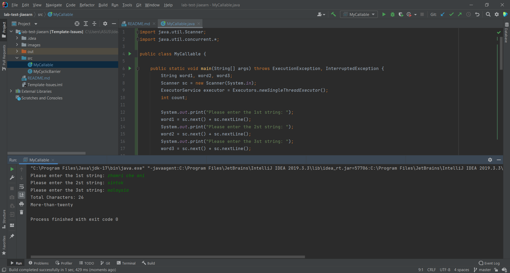
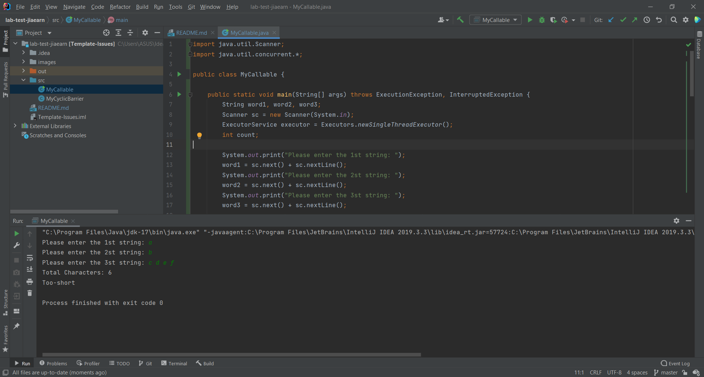
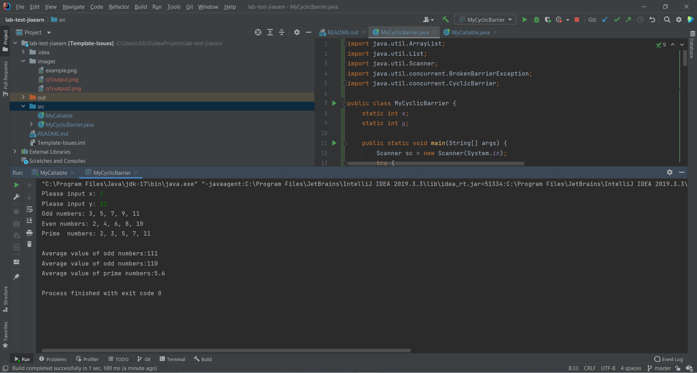

## Your Info:
1. Matric Number: 269509
2. Name: Tan Jia Earn


## Instruction
1. Answer all the questions and upload your source codes here.
2. No mark will be given for plagiarism activities.

## Question-1 (1 hour)

1. Write a Java program by implementing __Callable__ interface to count the total number of characters for __THREE(3)__ input strings. Then display the result using Future and ExecuterService interfaces. The strings MUST be input from the keyboard. If the number of characters is more than 20, then display "More-than-twenty". Otherwise, display "Too-short".

2. The program file and the class name which has the main method __MUST__ be named `MyCallable.java` and place in the `src` folder.

3. Screenshot the result and upload to this repo too.

### Example of the output
```
Please enter the 1st string: zhamri che ani
Please enter the 2nd string: sintok
Please enter the 3rd string: malaysia
Total Characters: 26
More-than-twenty
```

### Result/Output (Screenshot of the output)


## Question-2 (1 hour)

1. Write a Java program which has __THREE(3)__ threads.
   1. The first thread will calculate the average value of odd numbers between X and Y (excluding X and Y).
   1. The second thread will calculate the average value of even numbers between X and Y (excluding X and Y).
   1. The third thread will calculate the average value of prime numbers between X and Y (excluding X and Y). The result MUST be displayed after the first and second threads have completed. Use __CyclicBarrier__ to solve the problem. 
   1. If the result is an integer number, display the result using 8-digit binary number.

2. The values of X and Y  MUST be input from the keyboard. The program file and the class name which has the main method __MUST__ be named `MyCyclicBarrier.java` and place in the `src` folder.

3. Screenshot the result and upload to this repo too.

### Example of the output
```
Enter the X: 1
Enter the X: 12
Odd numbers: 3,5,7,9,11
Even numbers: 2,4,6,8,10
Prime numbers: 2,3,5,7,11

Average value of odd numbers: 00000111
Average value of even numbers: 00000110
Average value of prime numbers: 5.6
```

### Result/Output (Screenshot of the output)

Question-1



Question-2


